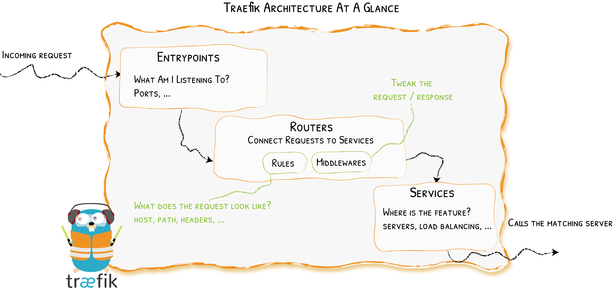

# Overview



- An entrypoint that expose ports to external network.
- A router to define route filters and link the entrypoint and the middlewares for a service
- A middleware where you can process the request before the service receive the request
- A service where you set the loadbalancer and endpoints for your service backend

# Configuration

## Expose Service

### docker

[docker-compose example](https://github.com/swissbuechi/boilerplates/tree/main/docker-compose/whoami)

### file

[file example](https://github.com/swissbuechi/boilerplates/blob/main/docker-compose/traefik/config/service-example.yml)

## Custom Port

Default is auto detect port

### docker

```yaml
labels:
  - 'traefik.http.services.<YOUR-SERVICE-NAME>.loadbalancer.server.port=9763'
```

## Self-Signed Certificates

It will automatically generate self-signed Certificates if no Default Certificate is provided.

### file

```yaml 
tls:
  stores:
    default:
      defaultCertificate:
        certFile: /etc/traefik/certs/cert.pem
        keyFile: /etc/traefik/certs/cert-key.pem
```

Replace the `/etc/traefik/certs/cert.pem` with your certificate file, and the `/etc/traefik/certs/cert-key.pem` with
your certificate key.

## Path based rules

```yaml
frontend:
  labels:
    - "traefik.http.routers.<YOUR-SERVICE-NAME-1>.rule=Host(`localhost`)"
api:
  labels:
    - "traefik.http.routers.<YOUR-SERVICE-NAME-2>.rule=Host(`localhost`) && Path(`/api`)"
```

## Redirect to https

### file

```yaml
http:
  middlewares:
    test-redirectscheme:
      redirectScheme:
        scheme: https
        permanent: true
```

### docker

```yaml
labels:
  - "traefik.http.middlewares.<YOUR-MIDDLEWARE-NAME>.redirectscheme.scheme=https"
  - "traefik.http.middlewares.<YOUR-MIDDLEWARE-NAME>.redirectscheme.permanent=true"
```

## Redirect to custom location

### file

```yaml
http:
  routers:
    redirect-test:
      rule: "Host(`example.ch`)"
      service: service1
      middlewares:
        - "test-redirectregex"
      tls:
        certresolver: le
  middlewares:
    test-redirectregex:
      redirectRegex:
        regex: "https://example.ch/(.*)"
        replacement: "https://redirect.example.ch/"
        permanent: true
  services:
    service1:
      loadBalancer:
        servers:
          - url: ""
```
